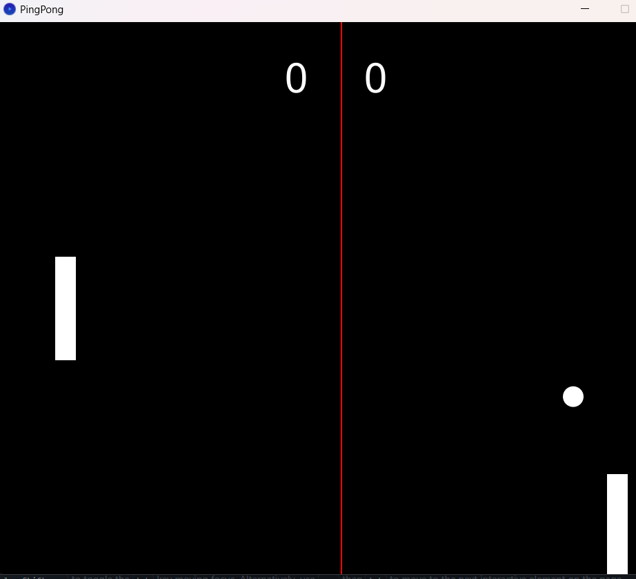

# 🎮 Ping Pong Game – Final Project OOP

Dibuat dengan **Processing** sebagai tugas akhir mata kuliah **Object-Oriented Programming (OOP)**.

## 📌 Deskripsi

Proyek ini adalah implementasi game **Ping Pong klasik** menggunakan paradigma pemrograman berorientasi objek di Processing. Game ini mengajak pemain untuk mengontrol paddle dan memantulkan bola selama mungkin sambil mencetak skor tertinggi.

## 🎯 Fitur Utama

* Kontrol paddle menggunakan keyboard (← dan →)
* Deteksi tumbukan bola dan paddle
* Peningkatan kecepatan bola secara bertahap
* Tampilan skor secara real-time
* Desain modular berbasis OOP (menggunakan class untuk bola dan paddle)

## 🧠 Konsep OOP yang Diterapkan

* **Class & Object**: Masing-masing entitas dalam game (bola, paddle) direpresentasikan sebagai objek.
* **Encapsulation**: Variabel dan fungsi dibungkus dalam class dengan akses terbatas.
* **Abstraction**: Game logic dipisahkan dari detail implementasi UI.

## ▶️ Cara Menjalankan

1. Pastikan kamu sudah menginstal **Processing IDE**: [https://processing.org/download](https://processing.org/download)
2. Buka folder proyek ini di Processing.
3. Jalankan `PingPong.pde` atau file utama dengan klik tombol **Play**.

## 🖼️ Tampilan Game
Berikut adalah tampilan dari game Ping Pong saat dijalankan:

## 👨‍💻 Author

* **Yuki Resky Damanik**
  Mahasiswa Universitas Prasetiya Mulya
  Mata Kuliah: Object-Oriented Programming

---
